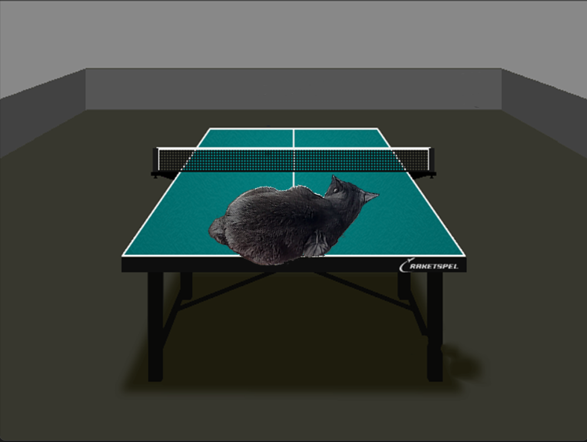

# Alpha Blending

## General Information

This project is a small program that is a part of the course in programming and computer architecture by [Ilya Dedinsky (aka ded32)](https://github.com/ded32) that he teaches in MIPT. This very program is one half of the task connected with using SSE and AVX optimizations. The second one is drawing [Mandelbrot set](https://github.com/KetchuppOfficial/Mandelbort_Set).

## Dependencies

Visualization of pictures is implemented with the help of [TXLib](https://github.com/ded32/TXLib) by [ded32](https://github.com/ded32). You have to install this library if you want to blend some pictures by means of my project.

## Build and run

This project is implemented for Windows only.

First of all, download this repository:
```bash
git clone git@github.com:KetchuppOfficial/Alpha_Blending.git
cd Alpha_Blending
```

Compile the program using the tool **make**. You can choose one on 2 modes:
```bash
make                    # for basic mode
make MODE=-DOPTIMIZED   # for SSE 4.2 mode
```

You can also choose one of compliler optimization flags as in the example below:
```bash
make OPT=-O2
```

To run the program, use **make** again:
```bash
make run FR=images\Cat.bmp BK=images\Table.bmp
```
**FR** - picture that is supposed to be on the foreground, **BK** - picture to place on the background.

There are some options of conditional compilations in [Alpha_Blending.hpp](Alpha_Blending.hpp):
```C++
#ifndef ALPHA_BLENDING_INCLUDED
#define ALPHA_BLENDING_INCLUDED

#include "../../TX/TXLib.h"
#include <emmintrin.h>
#include <time.h>

#define MEASURE 0           // <--- Set 1 to measure FPS
#define N_FRAMES 10000      // <--- Set the number of frames to draw
```

## Measurement of FPS

I ran a test that was calculating a frame for 2000 times. Only the time spent on the calculations was measured and all those time intervals were added. The average FPS was obtained by dividing the number of frames by mentioned aggregate time. You can see the results of this testing below.

### Average FPS:

| Optimization flag | Basic version | SSE version |
|-------------------|---------------|-------------|
|       None        |      165      |     122     |
|       -O1         |      420      |    1270     |
|       -O2         |      418      |    1337     |
|       -O3         |      434      |    1320     |

We see that both optimized and unoptimized versions are almost equal in performace if being compiled without any optimization flag. At the same time -O1, -O2 and -O3 boost each version approximately equally. The boost coefficient is ~ 1200 / 400 = 3.

## Example of alpha blended pictures


